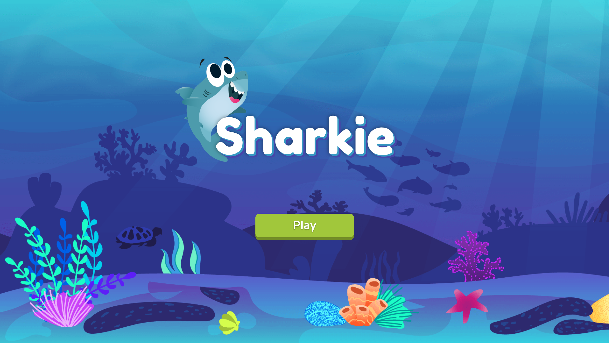

# Sharkie



Essa aplicação tem objetivo das video aulas ensinando sobre classe, entidade, objetos e hierarquias.

## :rocket: Tecnologias

- [x] [Javascript](https://developer.mozilla.org/pt-BR/docs/Web/JavaScript)
- [x] [HTML](https://developer.mozilla.org/pt-BR/docs/Web/HTML)
- [x] [CSS](https://developer.mozilla.org/pt-BR/docs/Web/CSS)

## Fluxo da aplicação

Aplicação de game com controles pelo teclado, possui uma quantitade de vida e tem o objetivo de chegar no final vivo.

### Acessando a aplicação

[Clique aqui para acessar](sharkie.desenvbr.com)


## Configurando ambiente

Não é necessário nenhuma configuração para rodar o projeto, apenas abrir no navegador o arquivo:
```text
index.html
```